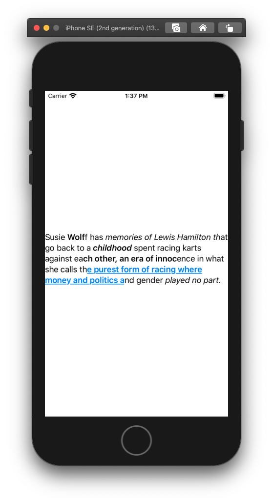

# Spanned Text to SwiftUI Text Converter

This example project demonstrates how to render a piece of spanned text (which comes from `sport-app-page` articles BFF) as a SwiftUI Text object.

## Example
The example text defined in [ExampleData](SwiftUISpannedText/ExampleData.swift) will render like:

